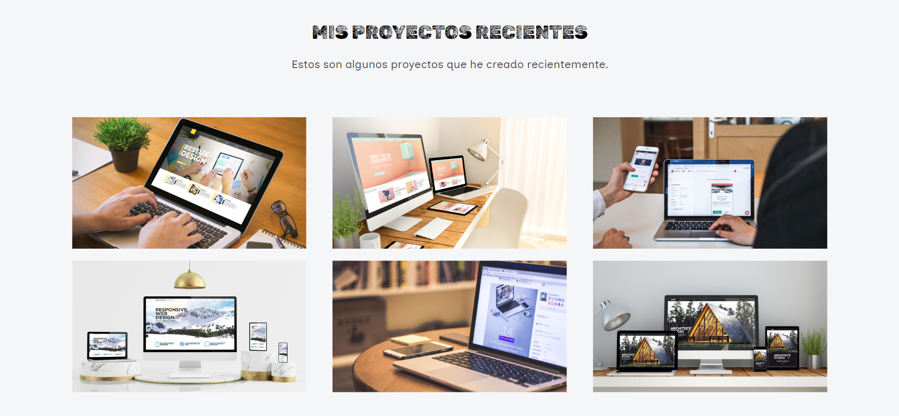

# 💼 PORTAFOLIO ADAPTABLE (RESPONSIVE) CON BOOTSTRAP 5

Este proyecto creado para el bootcamp Tecnolochicas PRO, es una página web adaptable a dispositivos de distintos tamaños (este tipo de sitio web se conoce en inglés como "responsive"). 

El propósito de esta página web es mostrar el portafolio de proyectos de un(a) desarrollador(a) y su experiencia. Incluye una descripción breve de su motivación, experiencia, proyectos, artículos publicados y formas de contacto. 

También incluye imágenes alternativas en la carpeta `imagenes` en caso de que se desee personalizar la imagen principal del desarrollador, además de animación a la escritura de la página web con JavaScript.

----------------------------
### 📸 CAPTURAS DE PANTALLA

#### *Primera parte de la página web*

  

#### *Experiencia*

  

#### *Proyectos*

  

#### *Testimonios*

  

#### *Contacto*

  

## 💻 TECNOLOGÍAS

Esta página web fue creada con:
* HTML
* CSS
* JavaScript 
* Bootstrap 5

Además, se incluyeron **Google Fonts** para personalizar la fuente y **Bootstrap icons** para incorporar íconos como flechas y logos de redes sociales populares. 
##### *NOTA:* 
El texto de la página web está escrito en español, al igual que las clases y atributos personalizados. Las clases relacionadas con Bootstrap se incluyeron en inglés.

